<details>
<summary>Introduction to Git</summary>
<br>

  
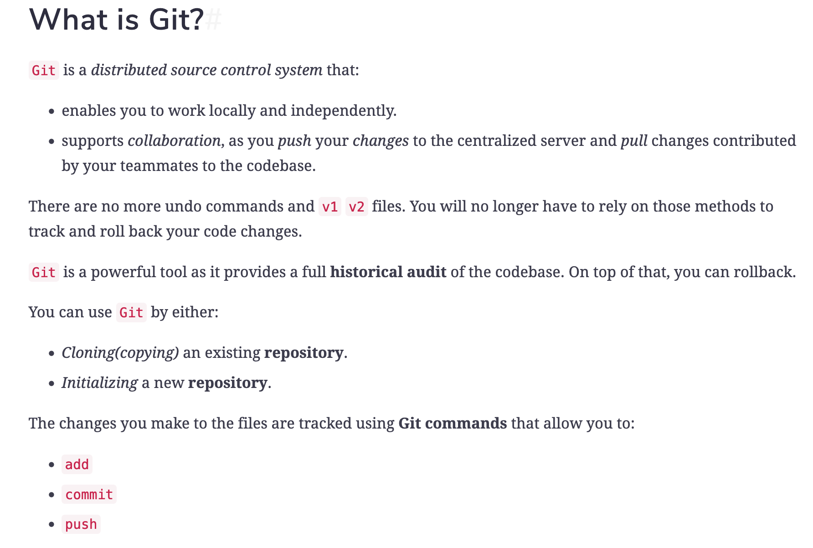  
  
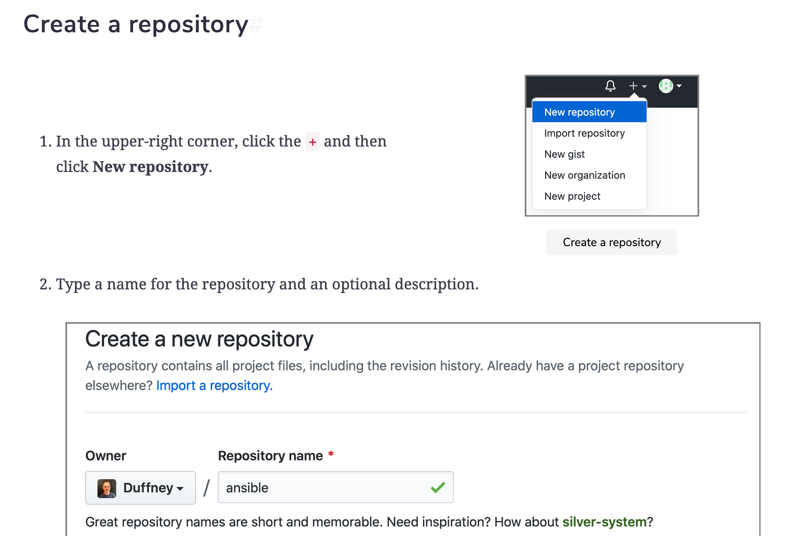  
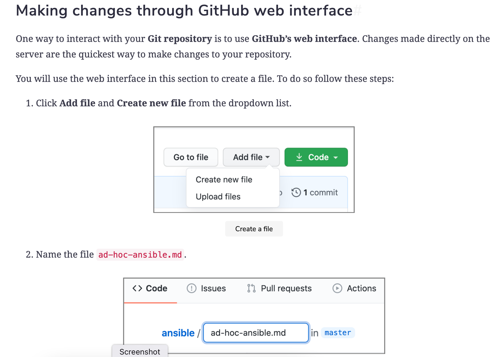  
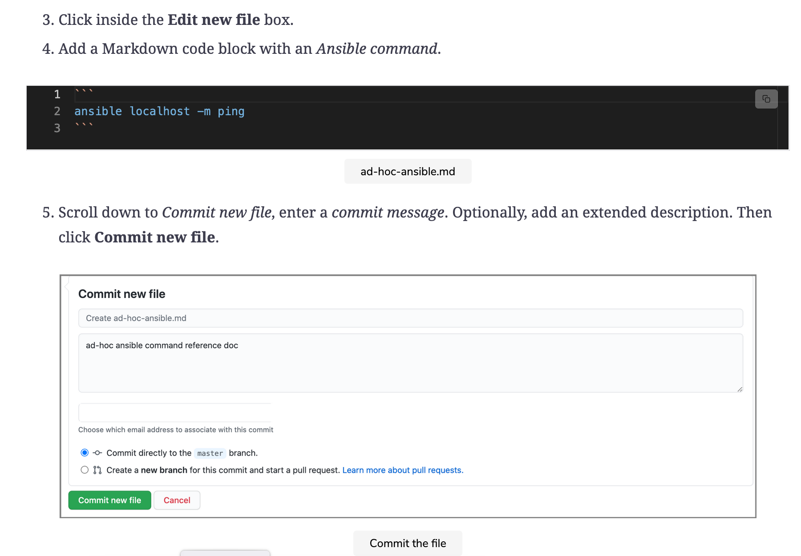  

Using GitHub’s web interface is simple, quick, and easy, but it has some drawbacks. Directly modifying the code on the server can be a problem when working with others. It doesn’t take advantage of the distributed feature of Git.
</details>

<details>
<summary>Connect to the Repository</summary>
<br>

  
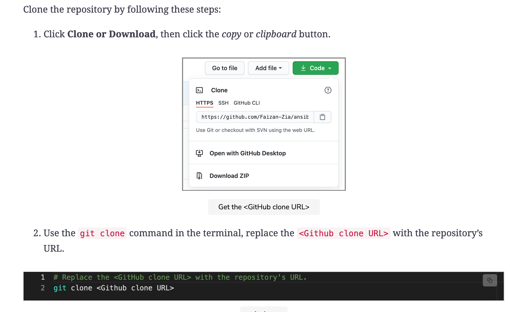  
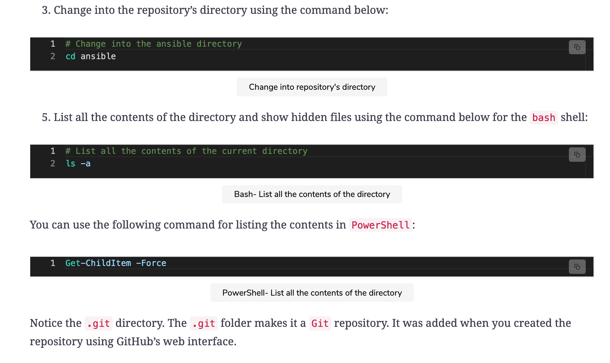  
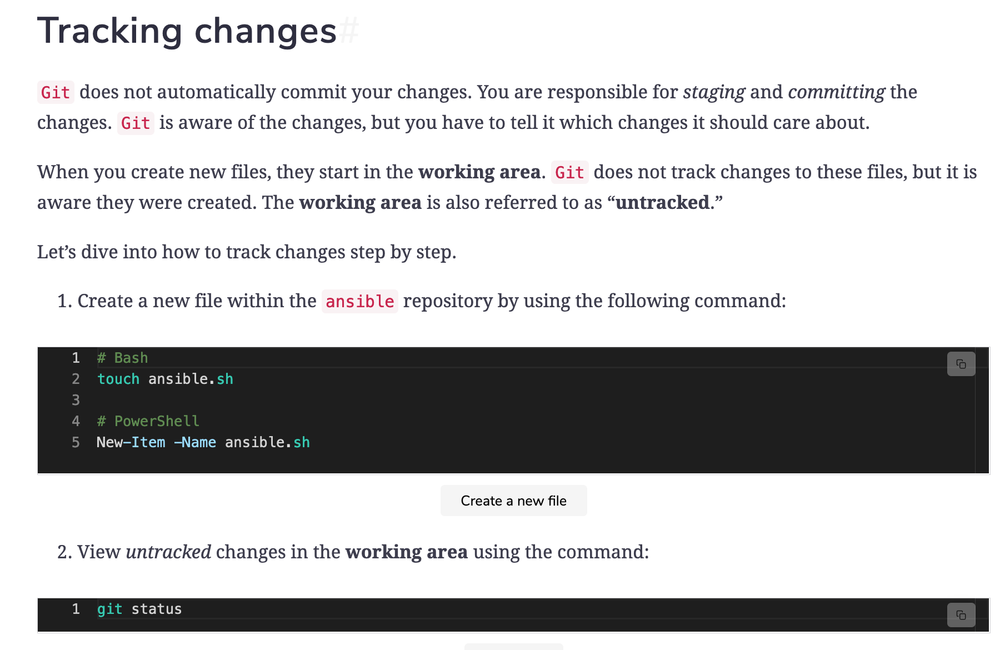  
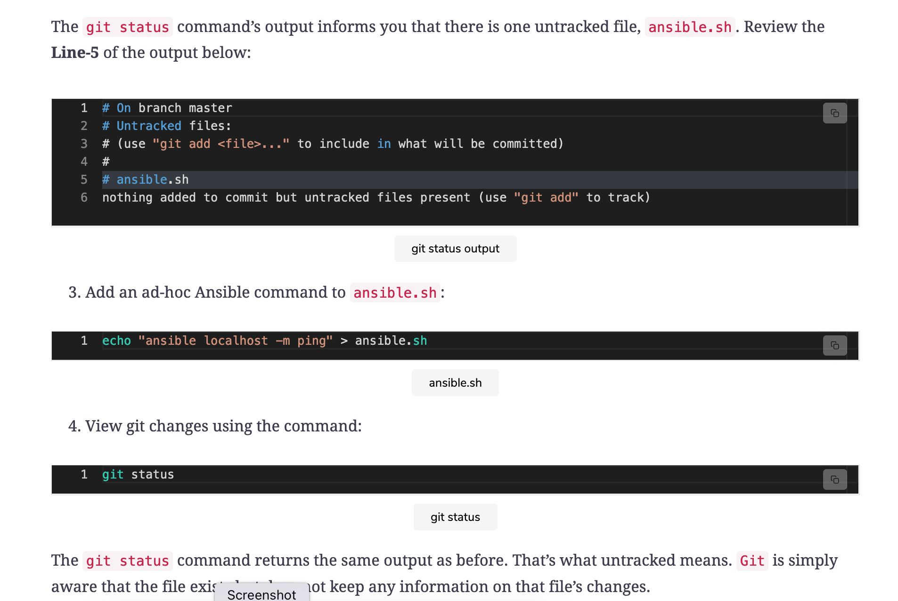  
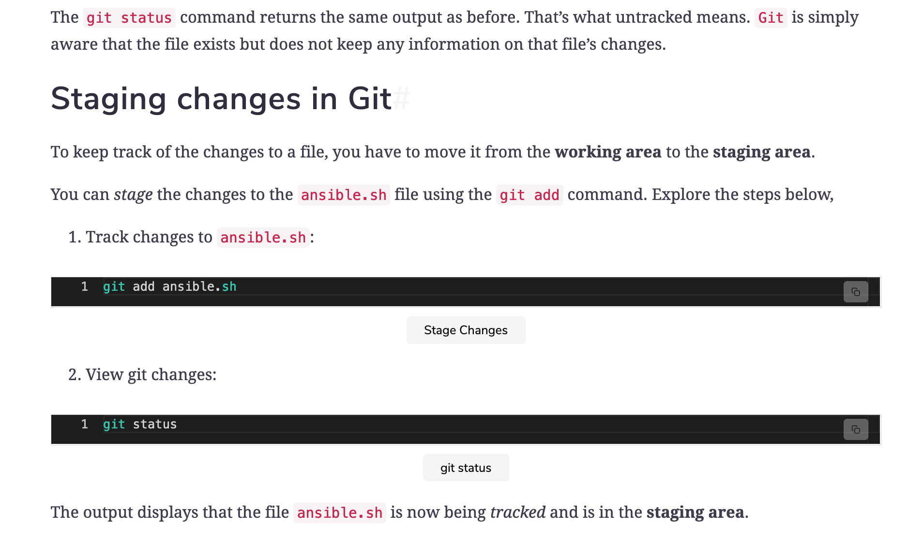  
  
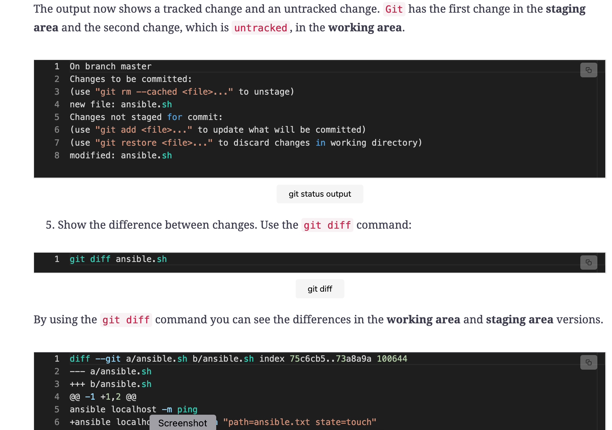  
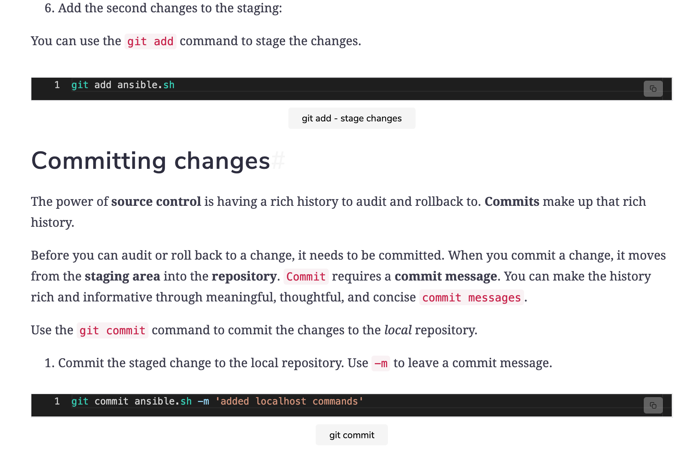  
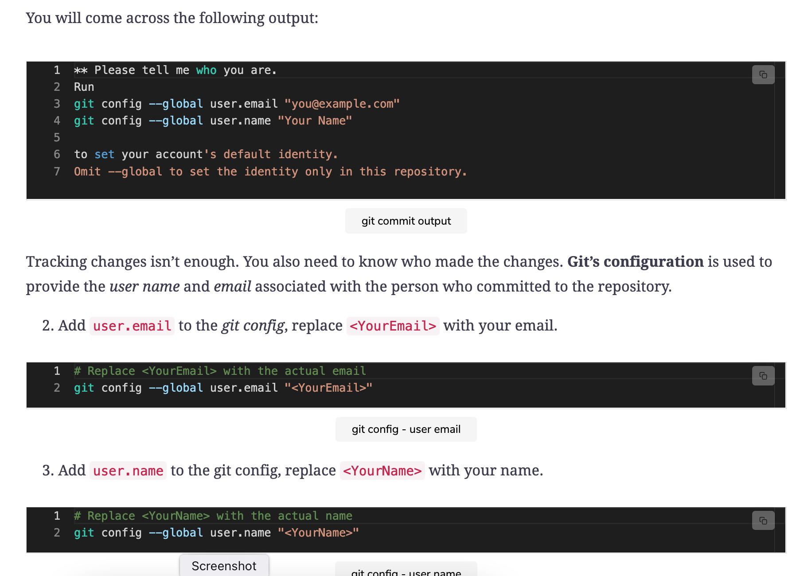  
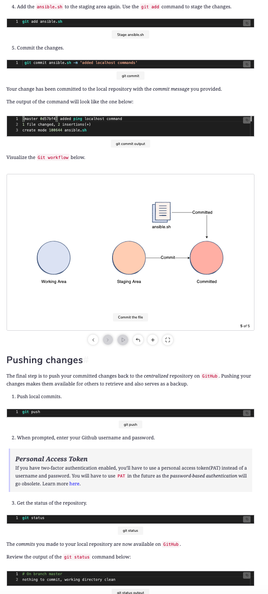  
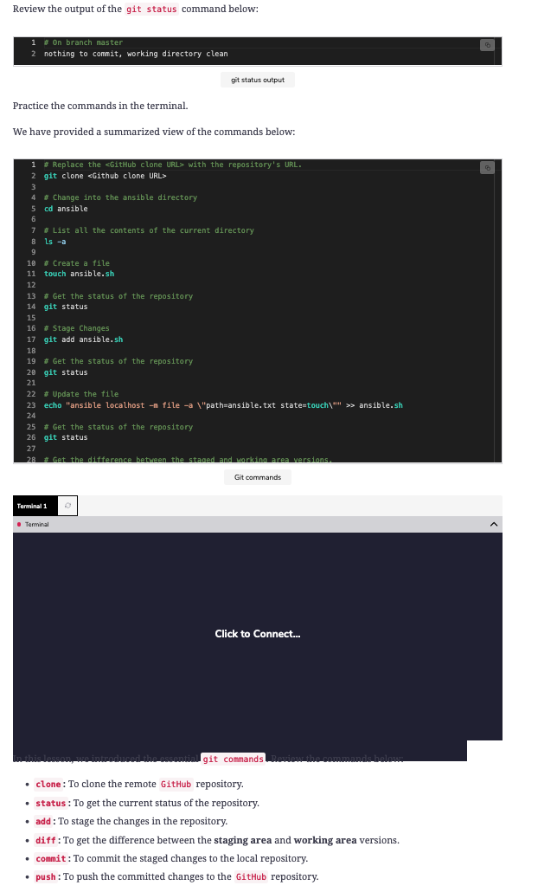  

```
# Replace the <GitHub clone URL> with the repository's URL.
git clone <Github clone URL>

# Change into the ansible directory
cd ansible

# List all the contents of the current directory
ls -a

# Create a file
touch ansible.sh

# Get the status of the repository
git status

# Stage Changes
git add ansible.sh

# Get the status of the repository
git status

# Update the file
echo "ansible localhost -m file -a \"path=ansible.txt state=touch\"" >> ansible.sh

# Get the status of the repository
git status

# Get the difference between the staged and working area versions.
git diff ansible.sh

# Stage the new changes
git add ansible.sh

# Commit the changes
git commit ansible.sh -m 'added localhost commands'

# Configure user.email
# Replace <Your email> with the actual email
git config --global user.email "<YourEmail>"

# Configure user.name
# Replace <Your name> with the actual name
git config --global user.name "<YourName>"

# Stage Changes
git add ansible.sh

# Push the commits
git push

# Get the status of the repository
git status
```
```
git remote add origin https://github.com/username/directory-name.git
git remote set-url origin https://<token>@github.com/username/directory-name.git
git branch -M main
git push -u origin main
```

</details>

<details>
<summary>Get-Hands-on-Git</summary>
<br>

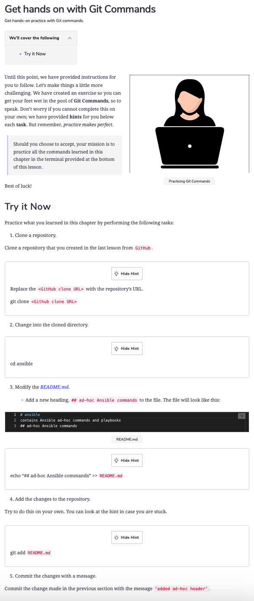  
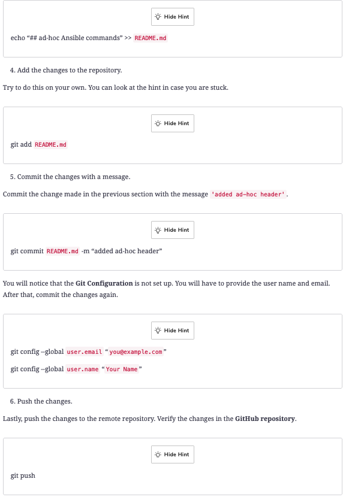  

</details>
