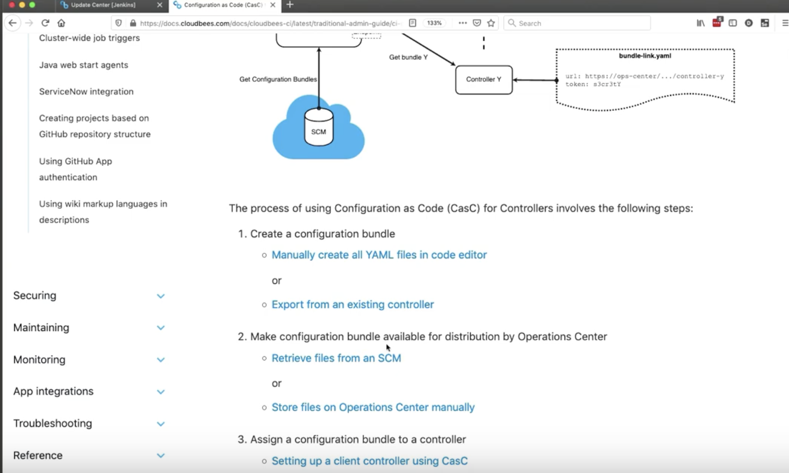
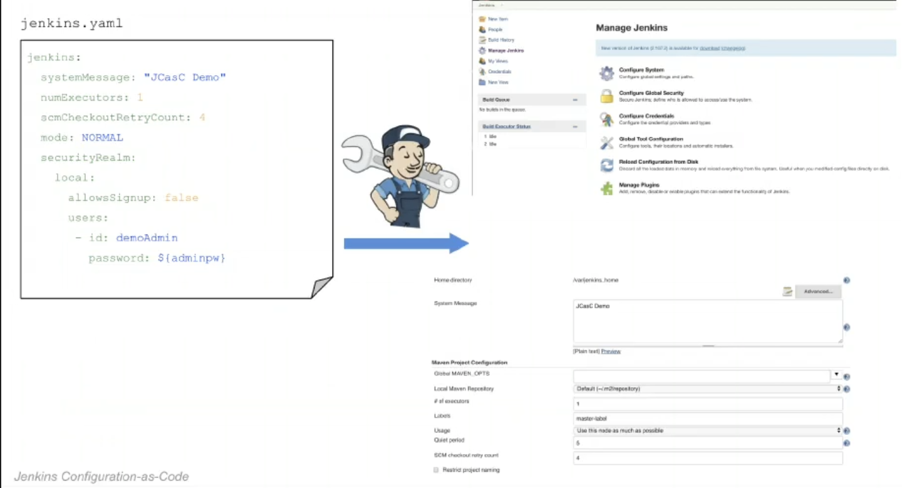
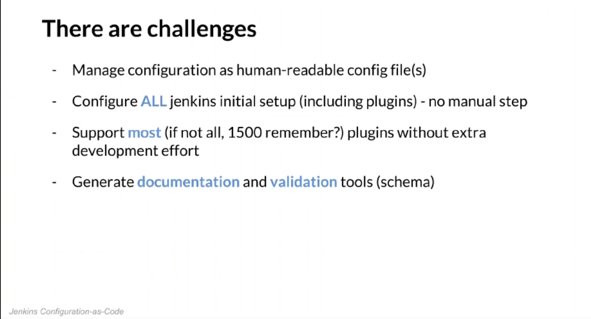
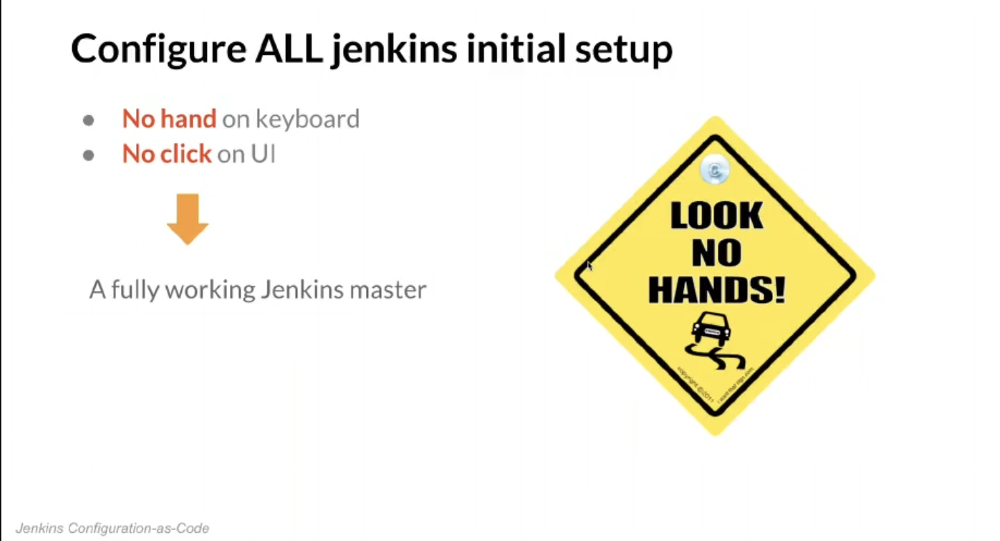
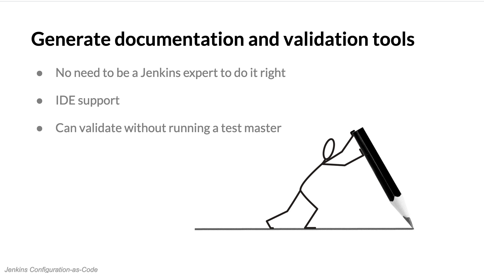
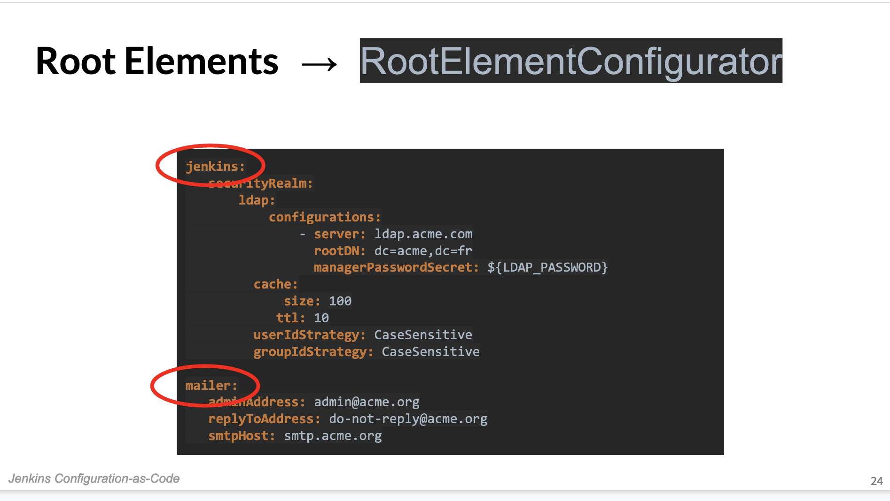
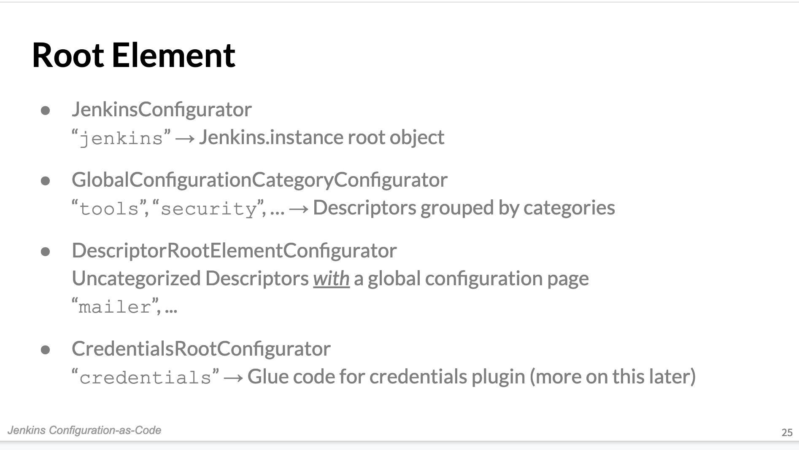
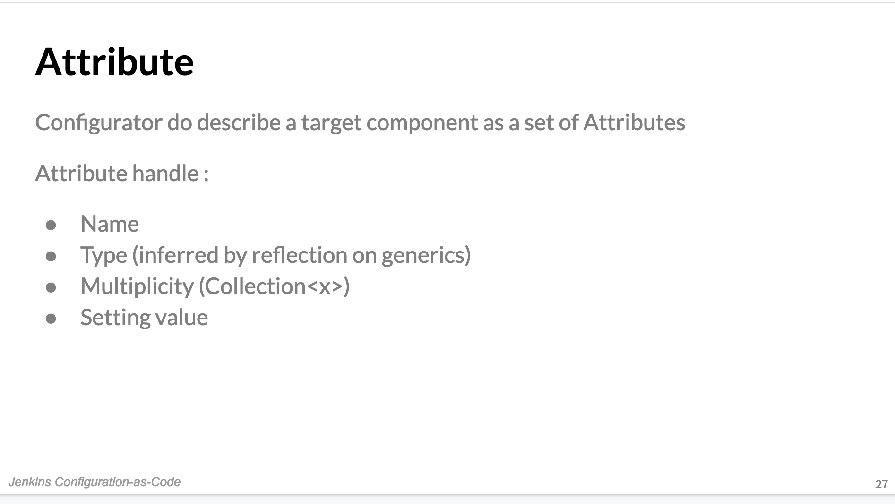
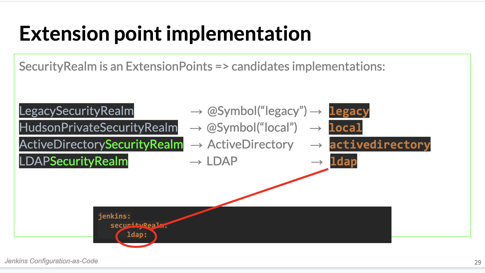
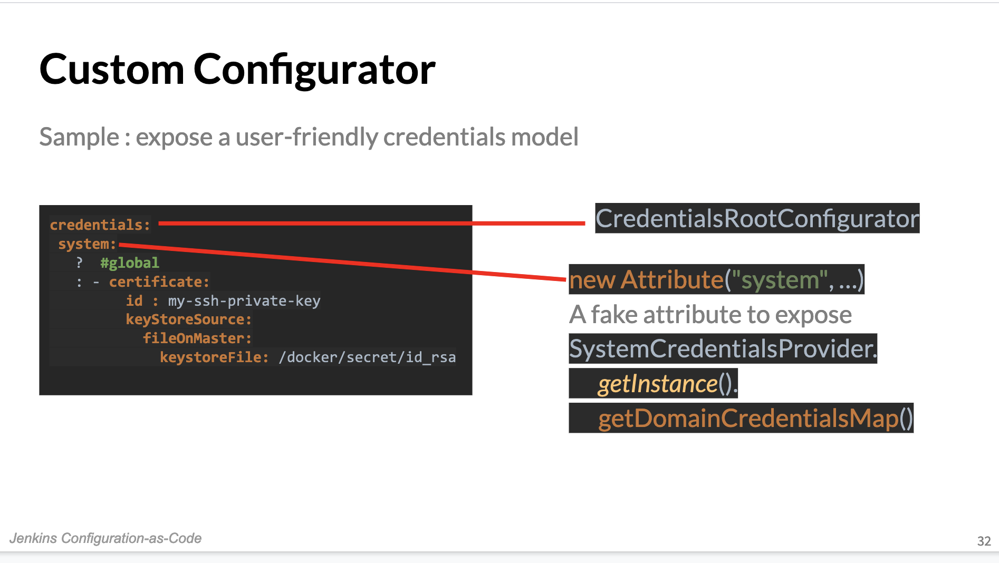

- Reference
- https://github.com/jenkinsci/configuration-as-code-plugin
- https://docs.google.com/presentation/d/1db0OutFJNMN1haXY_IdQoYesTSo65h2dz4nvu6nHGD4/edit#slide=id.g2ee113a618_1_21

Shared Lib

 

- generate Jenkins.yaml , it will be able to align the configuration under manage jenkins

  

  

  
  

  

  

  

  

  

  

  

  

  

  

  

* Read configuration from local drive or url
* Reload configuration (Manage Jenkins → Configuration as Code → Reload)
* Supported plugins: https://github.com/jenkinsci/configuration-as-code-plugin/tree/master/demos 

* Additionally docker demo setup (which can be easily adapted for different than demo purpose): 
* https://github.com/Praqma/praqma-jenkins-casc 

Repository: https://github.com/jenkinsci/configuration-as-code-plugin
Blogpost: https://www.praqma.com/stories/jenkins-configuration-as-code/
Plugin site: https://wiki.jenkins.io/display/JENKINS/Configuration+as+Code+Plugin

