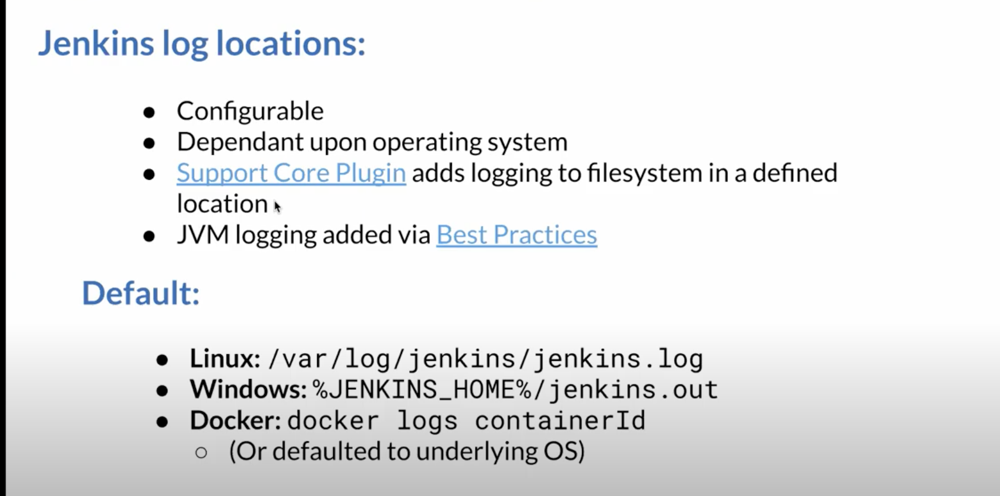
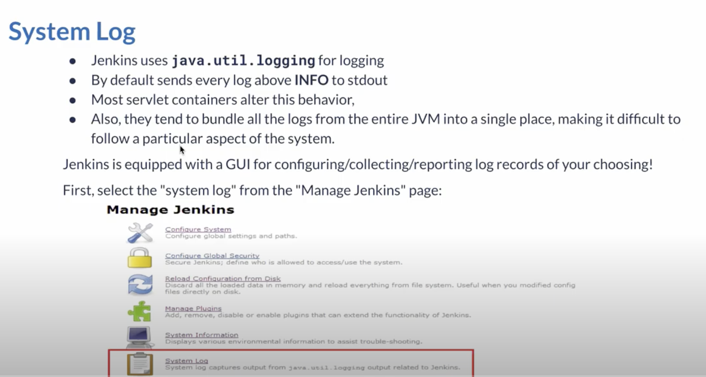
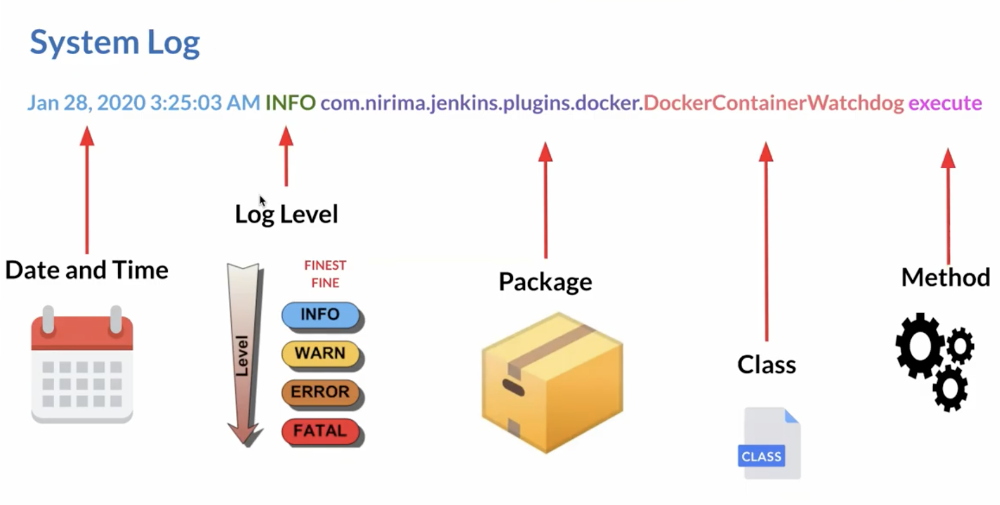
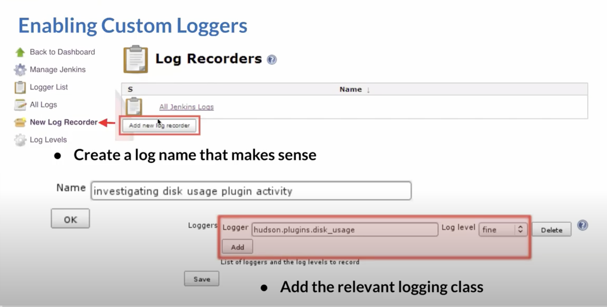
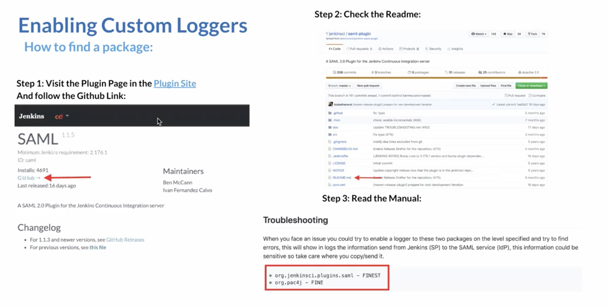
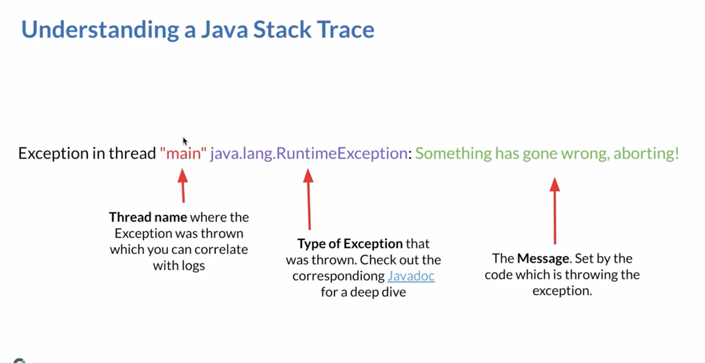
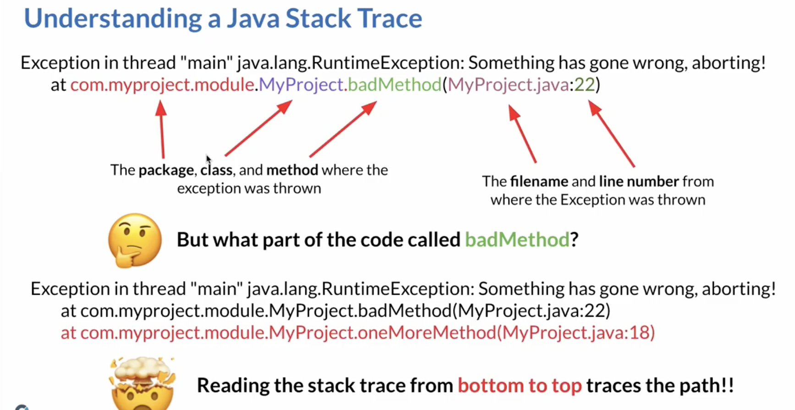

- monitoring scripts => https://github.com/jenkinsci/monitoring-plugin/blob/master/docs/MonitoringScripts.md


- change Jenkins_Home dir
```
systemctl stop jenkins
mkdir ~/jenkins_home
cd ~/jenkins_home
chown jenkins:jenkins ~/jenkins_home
cp -prv /var/lib/jenkins ~/jenkins_home
usermod -d ~/jenkins_home jenkins
vi /etc/default/jenkins
vi /etc/sysconfig/jenkins
systemctl start jenkins
cd jenkins/
cd logs
cd ~/jenkins_home
mkdir init.groovy.d
vi init.groovy.d/extra-logging.groovy
systemctl restart jenkins

```

- Create the following groovy file: $JENKINS_HOME/init.groovy.d/extra-logging.groovy

- Restart Jenkins and check directory $JENKINS_HOME/logs/

- journalctl -xe


```
import java.util.logging.ConsoleHandler
import java.util.logging.FileHandler
import java.util.logging.SimpleFormatter
import java.util.logging.LogManager
import jenkins.model.Jenkins

def logsDir = new File(Jenkins.instance.rootDir, "logs")

if(!logsDir.exists()){
    println "--> creating log dir";
    logsDir.mkdirs();
}

def loggerWinstone = LogManager.getLogManager().getLogger("");
FileHandler handlerWinstone = new FileHandler(logsDir.absolutePath + "/jenkins-winstone.log", 1024 * 1024, 10, true);

handlerWinstone.setFormatter(new SimpleFormatter());
loggerWinstone.addHandler (new ConsoleHandler());
loggerWinstone.addHandler(handlerWinstone);
```

  
  

  

  

  

- custom logs

  

  

  

  

- java stack trace
    
    
    
    

