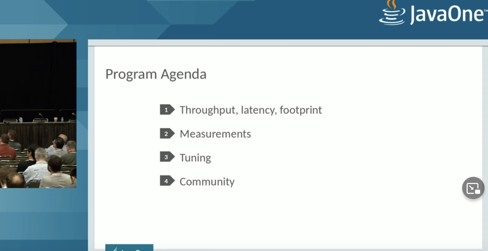
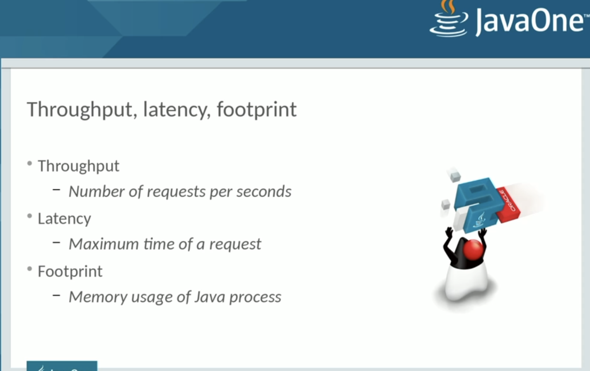
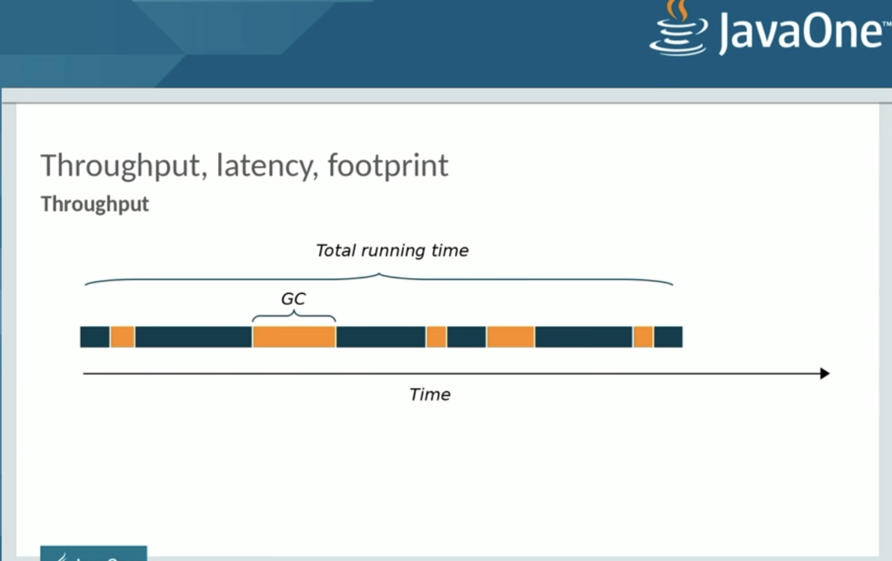
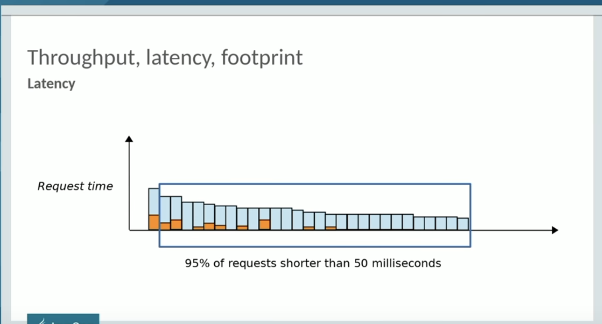
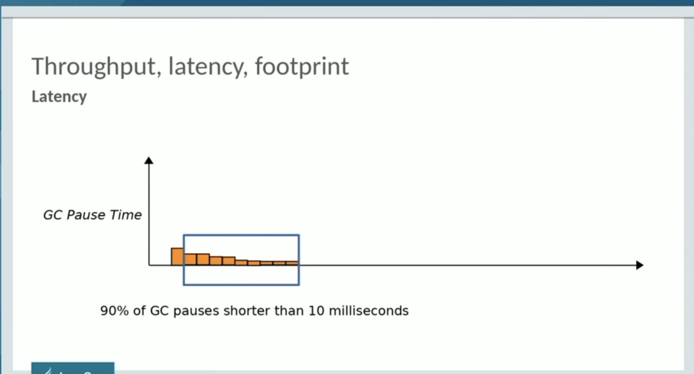
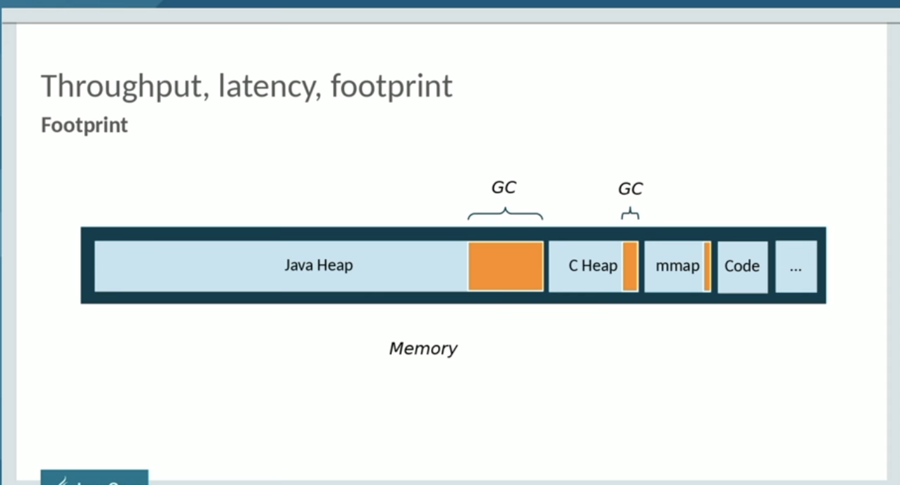
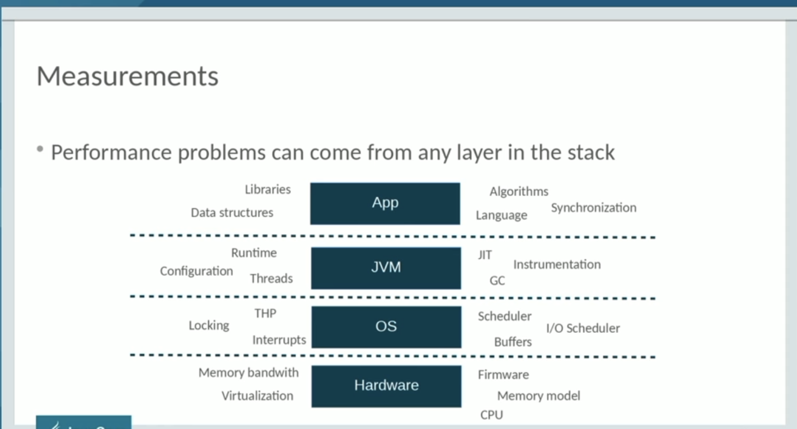
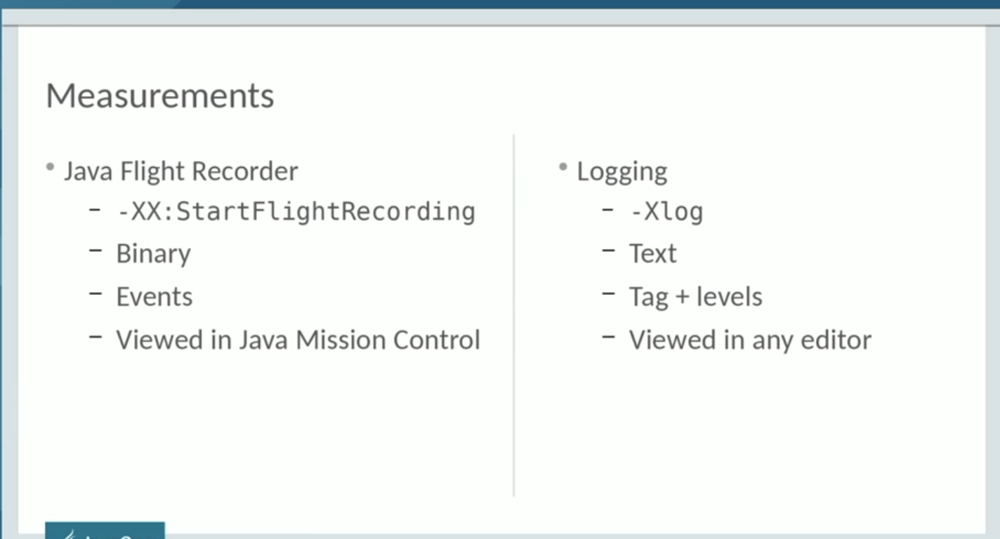
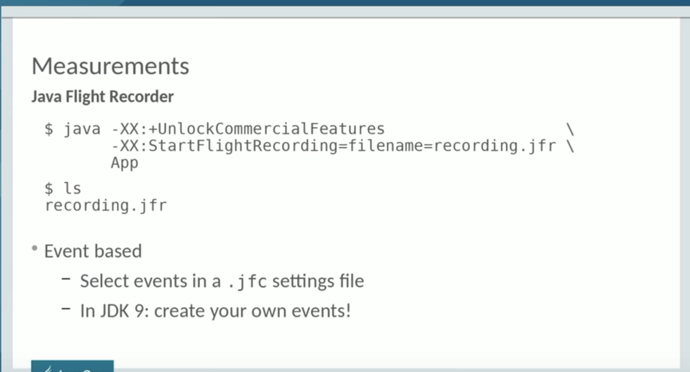

- https://www.serverlab.ca/tutorials/linux/administration-linux/how-to-reset-jenkins-admin-users-password/
- https://www.jenkins.io/blog/2016/11/21/gc-tuning/


<details>
<summary>Reference links</summary>
<br>
  [the_support_bundle.pdf](https://github.com/rupeshpanwar/quick-bite/files/9112387/the_support_bundle.pdf)

  
    - https://support.cloudbees.com/hc/en-us/articles/222446987-Prepare-Jenkins-for-Support
    - https://www.cloudbees.com/blog/enterprise-jvm-administration-and-jenkins-performance
    - https://docs.cloudbees.com/docs/admin-resources/latest/jvm-troubleshooting/
    - https://support.cloudbees.com/hc/en-us/articles/230922208-Pipeline-Best-Practices
    - https://wiki.jenkins.io/display/JENKINS/Active+Directory+plugin
    - https://go.cloudbees.com - CloudBees Support Knowledge Base
    - https://gceasy.io - Online analysis of Java GC logs
    - https://fastthread.io - Online analysis of Java thread dumps
    - https://tinyurl.com/jenkins-jvm-args - Recommended JVM settings for Jenkins
    - https://tinyurl.com/jenkins-thread-dump - How to get a thread dump from Jenkins
    - https://www.cloudbees.com/blog/enterprise-jvm-administration-and-jenkins-performance
  
  Jenkins Health Advisor by CloudBees
https://docs.cloudbees.com/docs/admin-resources/latest/plugins/cloudbees-jenkins-advisor

🗞️ Jenkins Health Advisor by CloudBees
https://plugins.jenkins.io/cloudbees-jenkins-advisor/

🗞️ Support Core
https://plugins.jenkins.io/support-core/

🗞️ Generating a support bundle
https://docs.cloudbees.com/docs/admin-resources/latest/support-bundle/

🗞️ Prepare Jenkins for Support
https://support.cloudbees.com/hc/en-us/articles/222446987-Prepare-Jenkins-for-support

🗞️ Which URLs would I need to grant access to for my firewall or proxy?
https://support.cloudbees.com/hc/en-us/articles/360028853171-Which-URLs-would-I-need-to-grant-access-to-for-my-firewall-or-proxy-

🗞️ My friend, the support bundle
https://speakerdeck.com/aheritier/my-friend-the-support-bundle

✅ Arnaud on Twitter:
https://twitter.com/aheritier


</details>


<details>
<summary>Introduction</summary>
<br>

  
  
  

  

  
</details>

<details>
<summary>Macro vs Micro Matrics</summary>
<br>

  

  

  

  

  

  
</details>

<details>
<summary>Challenges</summary>
<br>

  

  

  

  

  

  

  

  

  

  

  

  

  

  

  

  

  
</details>

<details>
<summary>Real world example</summary>
<br>

  

  

  

  

  

  

  

  

  
</details>

<details>
<summary>Performance & Health tools</summary>
<br>
  
  

  

  

  

  

  

  - generate n download bundle
  

  - performance warning
  

  

  

  

  

  

  

  
</details> 


<details>
<summary>Backup - Performance - Best Practices</summary>
<br>
  
  https://www.youtube.com/watch?v=9-DUVroz7yk
  
  

  

  

  

  

  

  

  

  

  

  

  

  

  

  - challenge with admin
  

  

  - https://docs.cloudbees.com/docs/cloudbees-ci-kb/latest/client-and-managed-masters/how-to-add-java-arguments-to-jenkins
  
  

  

  - countdown
  

  

  - https://plugins.jenkins.io/jobConfigHistory/
  
  - backup
  

  

  - https://www.cloudbees.com/blog/enterprise-jvm-administration-and-jenkins-performance
 
  

  - real world data
  

  
  

  
</details> 


<details>
<summary>GC Tuning & Troubleshooting</summary>
<br>
  
  

  

  

  

  

  

  

  

  

  

  

  

  

  

  
  

  

  

  

  

  
</details> 


<details>
<summary> G1GC Concepts and Performance Tuning </summary>
<br>

    

    

    

    
    

    

    

    

  - Measurement

    

    

    

      
</details>


- https://www.jenkins.io/blog/2016/11/21/gc-tuning/
- https://github.com/chewiebug/GCViewer
- https://gceasy.io/


The Magic Settings:
Basics: -server -XX:+AlwaysPreTouch

GC Logging: -Xloggc:$JENKINS_HOME/gc-%t.log -XX:NumberOfGCLogFiles=5 -XX:+UseGCLogFileRotation -XX:GCLogFileSize=20m -XX:+PrintGC -XX:+PrintGCDateStamps -XX:+PrintGCDetails -XX:+PrintHeapAtGC -XX:+PrintGCCause -XX:+PrintTenuringDistribution -XX:+PrintReferenceGC -XX:+PrintAdaptiveSizePolicy

G1 GC settings: -XX:+UseG1GC -XX:+ExplicitGCInvokesConcurrent -XX:+ParallelRefProcEnabled -XX:+UseStringDeduplication -XX:+UnlockExperimentalVMOptions -XX:G1NewSizePercent=20 -XX:+UnlockDiagnosticVMOptions -XX:G1SummarizeRSetStatsPeriod=1

Heap settings: set your minimum heap size (-Xms) to at least 1/2 of your maximum size (-Xmx).

* vi /etc/sysconfig/jenkins
* JENKINS_JAVA_OPTIONS="-Xmx2048m -Xms1024m -XX:MaxPermSize=1024m -Djava.awt.headless=true-XX:+UseG1GC -XX:+ExplicitGCInvokesConcurrent -XX:+ParallelRefProcEnabled -XX:+UseStringDeduplication -XX:+UnlockExperimentalVMOptions -XX:G1NewSizePercent=20 -XX:+UnlockDiagnosticVMOptions -XX:G1SummarizeRSetStatsPeriod=1 -Djenkins.model.Jenkins.logStartupPerformance=true"

- With heaps of 4 GB or larger, the time required becomes long enough to be a problem: several seconds over short windows, and over a longer interval you occasionally see much longer pauses (tens of seconds, or minutes.) .This is where the user-visible hangs and lock-ups happen. It also adds significant latency to those build/deploy tasks. In periods of heavy load, the system was even experiencing hangs of 30+ seconds for a single full GC cycle.

- We’re going to focus on G1, because it is slated to become the default in Java 9 and is the official recommendation for large heap sizes.Let’s see what happens when someone uses G1 on a similarly-sized Jenkins controller with Instance B (17 GB heap):

Key stats:

1. Throughput: 99.93%
2. Average GC time: 127 ms
3. GC cycles over 2 seconds: 235 (1.56%)
4. Minor/Full GC average time: 56 ms / 3.97 sec
5. Object creation & promotion rate: 34.06 MB/s & 286 kb/s

Their settings:
* 16 GB max heap, 0.5 GB initial size
* Java flags (mostly defaults, except for G1): -XX:+UseG1GC -XX:+UseCompressedClassPointers -XX:+UseCompressedOops


G1 Garbage Collection with Instance C (24 GB heap):

Their settings:
* 24 GB max heap, 24 GB initial heap, 2 GB max metaspace
* Some custom flags: `-XX:+UseG1GC -XX:+AlwaysPreTouch -XX:+UseStringDeduplication -XX:+UseCompressedClassPointers -XX:+UseCompressedOops `

How do we fix this?

For explicit GC:

* -XX:+DisableExplicitGC will turn off Full GC triggered by System.gc(). Often set in production, but the below option is safer.
* We can trigger a concurrent GC in place of a full one with -XX:+ExplicitGCInvokesConcurrent - this will take the explicit call as a hint to do deeper cleanup, but with less performance cost.
* For the Metadata GC threshold:
Increase your initial metaspace to the final amount to avoid resizing. For example: -XX:MetaspaceSize=500M

* So, we add the GC flag -XX:+ParallelRefProcEnabled which enables us to use the multiple cores more effectively
* we set up for 24 GB of heap initially, and each minor GC clears most of the young generation. Okay, so we’ve set aside tons of space for trash to collect, which means longer but less frequent GC periods. This also gets the best performance from Jenkins memory caches which are using WeakReferences (survives until collected by GC) and SoftReferences (more long-lived). Those caches boost performance a lot.
*  limit total heap size or reduce the value of -XX:MaxGCPauseMillis=200 from its default (200).
*  explicitly set the maximum size of the young generation smaller (say -XX:G1MaxNewSizePercent=45 instead of the default of 60). We could also throw more CPUs at the problem.
*   controlled by -XX:SoftRefLRUPolicyMSPerMB (default 1000). The SoftReferences become eligible for garbage collection after this many milliseconds have elapsed since last touch…​ 

What Should I Do Before Tuning Jenkins GC:
If you’ve seen Stephen Connolly’s excellent Jenkins World talk, you know that most Jenkins instances can and should get by with 4 GB or less of allocated heap, even up to very large sizes. You will want to turn on GC logging (suggested above) and look at stats over a few weeks (remember GCeasy.io). If you’re not seeing periodic longer pause times, you’re probably okay.

For this post we assume we’ve already done the basic performance work for Jenkins:

Jenkins is running on fast, SSD-backed storage.

We’ve set up build rotation for your Jobs, to delete old builds so they don’t pile up.

The weather column is already disabled for folders.

All builds/deploys are running on build agents not on the controller. If the controller has executors allocated, they are exclusively used for backup tasks.

We’ve verified that Jenkins really does need the large heap size and can’t easily be split into separate controllers.

Conclusions
We’ve gone from:

Average 350 ms pauses (bad user experience) including less frequent 2+ second generation pauses

To an average pause of ~50 ms, with almost all under 250 ms

Reduced total memory footprint from String deduplication

How:

Use Garbage First (G1) garbage collection, which performs generally very well for Jenkins. Usually there’s enough spare CPU time to enable concurrent running.

Ensure explicit System.gc() and metaspace resizing do not trigger a Full GC because this can trigger a very long pause

Turn on parallel reference processing for Jenkins to use all CPU cores fully.

Use String deduplication, which generates a tidy win for Jenkins

Enable GC logging, which can then be used for the next level of tuning and diagnostics, if needed.

</details>

<details>
<summary> java-garbage-collection-distilled </summary>
<br>
- https://mechanical-sympathy.blogspot.com/2013/07/java-garbage-collection-distilled.html
  
   3 major variables that set targets for the collectors:
* Throughput: The amount of work done by an application as a ratio of time spent in GC. Target throughput with ‑XX:GCTimeRatio=99 ; 99 is the default equating to 1% GC time.
* Latency: The time taken by systems in responding to events which is impacted by pauses introduced by garbage collection. Target latency for GC pauses with ‑XX:MaxGCPauseMillis=<n>.
* Memory: The amount of memory our systems use to store state, which is often copied and moved around when being managed. The set of active objects retained by the application at any point in time is known as the Live Set. Maximum heap size –Xmx<n> is a tuning parameter for setting the heap size available to an application.

Tradeoffs often play out as follows:
* To a large extent the cost of garbage collection, as an amortized cost, can be reduced by providing the garbage collection algorithms with more memory.
* The observed worst-case latency-inducing pauses due to garbage collecting can be reduced by containing the live set and keeping the heap size small.
* The frequency with which pauses occur can be reduced by managing the heap and generation sizes, and by controlling the application’s object allocation rate.
* The frequency of large pauses can be reduced by concurrently running the GC with the application, sometimes at the expense of throughput.
* Time To Safepoint (TTSP) is an important consideration in low-latency applications. This time can be surfaced by enabling the ‑XX:+PrintGCApplicationStoppedTime flag in addition to the other GC flags.
* Large objects (-XX:PretenureSizeThreshold=<n>) may fail to be accommodated in the young generation and thus have to be allocated in the old generation, e.g. a large array. If the threshold is set below TLAB size then objects that fit in the TLAB will not be created in the old generation. The new G1 collector handles large objects differently and will be discussed later in its own section.


Garbage Collection Monitoring & Tuning

To understand how your application and garbage collector are behaving, start your JVM with at least the following settings:
```
-verbose:gc
-Xloggc:
-XX:+PrintGCDetails
-XX:+PrintGCDateStamps
-XX:+PrintTenuringDistribution
-XX:+PrintGCApplicationConcurrentTime 
-XX:+PrintGCApplicationStoppedTime

```

- https://github.com/chewiebug/GCViewer

</details>


<details>
<summary> Monitoring Jenkins</summary>
<br>

When Jenkins is running or has run out of RAM, it normally has a few root causes:

* growth in data size requiring a bigger heap space
* a memory leak
* The operating system kernel running out of virtual memory
* multiple threads need the same locks but obtain them in a different order

To identify the root cause of memory leaks, it normally requires access to one of three log sources
* the garbage collection logs,
* a heap dump
* a thread dump.

> Open the old data management page (located at your-jenkins-url/administrativeMonitor/OldData/manage), verify that the data is not needed, and clear it

* consider implementing on the JVM for Jenkins. This feature is called UseCompressedOops, a

constantly check and analyze Jenkins performance by implementing configurations for:

* Monitoring memory usage. This checking and monitoring RAM memory usage continuously for Jenkins master / slave node
* Checking java memory leak
* Adding correct java option arguments/parameters which are suggested by Jenkins official documents
* Monitoring with the correct plugin. The monitoring plugin will help you to monitor running setup with live scaled data. This will involve, install the monitoring plugin and monitor Jenkins memory usage
* With the plugin, add monitoring alerts for deadlock, threads, memory, and active sessions. You can add monitoring alerts to capture threshold baseline details and present it in tooling such as the ELK ‘stack’ – ElasticSearch, LogStash, Kibana, to perform a search, analysis, and visualization operations in real-time

* if you are receiving high CPU alerts or are experiencing application performance degradation, this may be due to 
* a Jenkins process being stuck in an infinite loop (normally deadlock threads), 
* repeated full Garbage collections, 
* or that the application has encountered an unexpected error. 

If the JVM for Jenkins is using close to 100% of the CPU consumption, it will constantly have to free up processing power for different processes, which will slow it down and may render the application unreachable.

PermGen is one of the primary Java memory regions and has a limited amount of memory without customization. Application of the JVM parameters
** -Xmx and -XX:MaxPermSize** will help rectify this problem

> executing the jenkinshangWithJstack.sh script while the CPU usage is high

as it will deliver the outputs of top and top -H while the issue is occurring, so you can see which threads are consuming the most CPU.

Excessive CPU usage can be reduced or tempered by the following actions:

* Minimizing the number of builds on the master node. This meaning you want to make the Jenkins master as “free” from work as you can, leaving the CPU and memory to be used for scheduling and triggering builds on slaves only
* Looking at the garbage collection logs to see if there’s a memory leak
* From repeated build processes, not keeping too much of the build history. Trying to limit it
* Making sure your Jenkins & installed plugins version, are installed with the most up to date stable releases
* Constantly monitor CPU performance, by checking and monitoring the CPU usage for Jenkins slaves the master node. Resulting outputs can be analyzed in the ELK stack

The garbage collector is an automatic memory management process.

Its main goal is to identify unused objects in the heap and release the memory that they hold. Some of the GC actions can cause the Jenkins program to pause. This will mostly happen when it has a large heap (normally 4GB). In those cases, GC tuning is required to shorten the pause time. If Jenkins is processing a large heap but requires low pause times, then you should consider as a starting point, the use of the G1GC collector. It will help manage its memory usage more efficiently

By default the JVM is configured to throw this error if it spends more than 98% of the total time doing GC and when after the GC only less than 2% of the heap is recovered.

To manage the Garbage Collector more effectively and allow it to compact the heap on-the-go, it is suggested to apply the following configurations.

* Enable GC logging
* Enable G1GC – this is the most modern GC implementation (depending on JDK version)
* Monitor GC behavior with plugins, services or toolings
* Tune GC with additional flags as needed
* Utilise the ELK stack to analyze the logging source
* Keep monitoring and attach any key metric alerting to the logging process
This will involve tuning the garbage collection and setting arguments on the JVM for Jenkins.

To ensure you follow some best practice for securing your Jenkins instance and jobs:

* Enable Jenkins’ security. Jenkins global security is the first line of defense in protecting the asset it controls. Core Jenkins supports four security realms: delegate to servlet container, Jenkins’s own user database, LDAP, and Unix user/group database
* Consider the use of the Jenkins credentials plugin, that can provide a default internal credentials store. This can be used to store high value or privileged credentials, such as GitHub tokens
* Configuring access control in Jenkins using a Security Realm and Authorization configuration. A Security Realm, informs the Jenkins environment, how and where to pull user (or identity) information from. Authorization configuration which informs the Jenkins environment as to which users and/or groups can access which aspects of Jenkins


</details>
